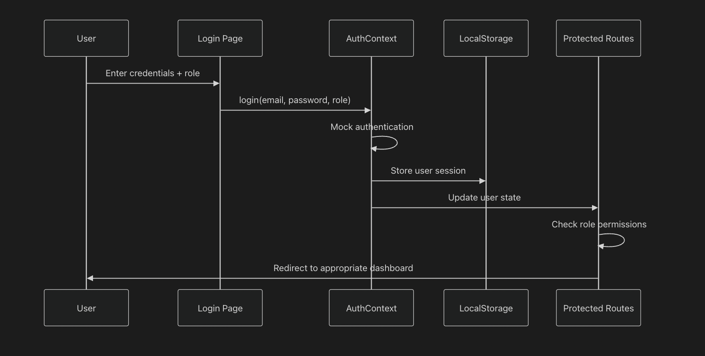
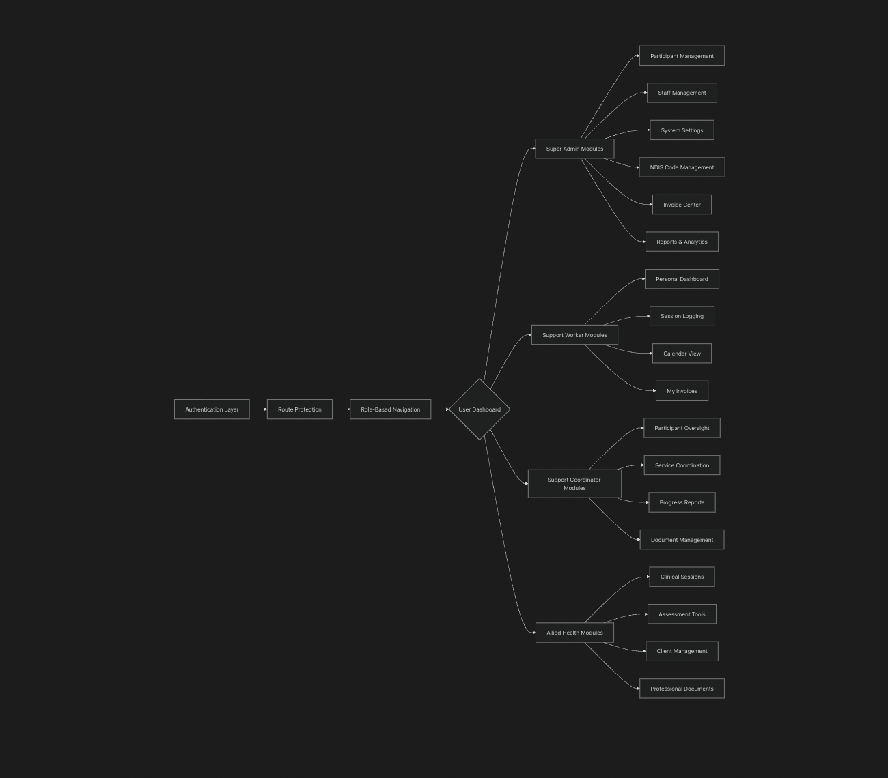
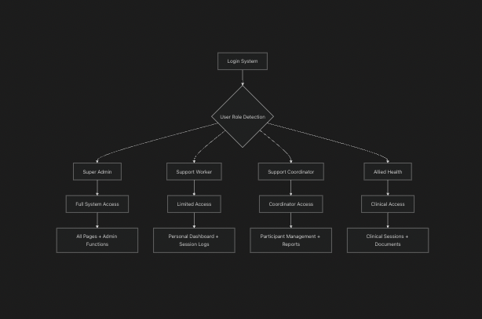

# NDIS Platform Documentation

## System Architecture Overview

The NDIS Platform is a comprehensive web application designed to manage disability support services with role-based access control and modern React architecture.

## Tech Stack

- **Frontend Framework**: React 18 with TypeScript
- **Backend**: Node/Express.js or Supabase
- **Build Tool**: Vite/Node
- **Styling**: Tailwind CSS with custom design system
- **UI Components**: Radix UI primitives with custom shadcn/ui components
- **Routing**: React Router DOM v6
- **Forms**: React Hook Form with Zod validation
- **State Management**: React Context API (AuthContext)
- **Charts**: Recharts for data visualization
- **Icons**: Lucide React
- **Session Storage**: localStorage for authentication persistence

## Authentication Flow

The authentication system follows a secure flow where users enter credentials with their role, which are validated through the AuthContext. Upon successful authentication, user sessions are stored in localStorage and the system redirects users to role-appropriate dashboards.

## System Architecture Flow

The application architecture is organized into three main flows:

### Authentication and Route Protection Flow
1. **Authentication** → **LocalStorage** → **Session Persistence** → **Route Protection**

### User Interaction and UI Update Flow
1. **User Interaction** → **React Components** → **Form Validation (Zod)** → **State Management (Context)** → **Mock Data Services** → **UI Update (Re-render)**

### Role-Based Access Flow
1. **Role-Based Access** → **Component Rendering** → **Navigation Filtering** → **Feature Availability**

## User Role Management

The platform implements a comprehensive role-based access control system with four distinct user roles:

### Super Admin (Provider Admin)
- **Access Level**: Full System Access
- **Features**: All Pages + Admin Functions
- **Dashboard**: System KPIs, quick actions, health monitoring
- **Participant Management**: Full CRUD, assignment to staff
- **Staff Management**: Full CRUD, role assignments, permissions
- **Shift Logs/Timesheets**: Approval workflow, bulk operations
- **Invoice Center**: Auto-generation, NDIS integration, PDF export
- **NDIS Item Code Manager**: Price list management, bulk import/export
- **Document Storage**: System-wide document management, expiry alerts
- **Calendar View**: Appointment scheduling, resource management
- **Reports & Analytics**: System-wide KPIs, financial reports, audit logs
- **Settings**: System configuration, security, user management

### Support Worker
- **Access Level**: Limited Access
- **Features**: Personal Dashboard + Session Logs
- **My Dashboard**: Personal schedule, upcoming shifts, recent sessions
- **Session Logging**: Time tracking, service documentation
- **Calendar View**: Personal schedule management
- **My Profile**: Personal settings and certifications

### Support Coordinator
- **Access Level**: Coordinator Access
- **Features**: Participant Management + Reports
- **Dashboard**: Caseload overview, participant progress
- **My Participants**: Assigned participants, goal tracking
- **Session Notes**: Detailed support documentation
- **Reports**: Participant progress, service summaries

### Allied Health Professional
- **Access Level**: Clinical Access
- **Features**: Clinical Sessions + Documents
- **Dashboard**: Clinical appointments, client overview
- **My Clients**: Clinical case management
- **Assessment Tools**: Structured assessment templates
- **Clinical Documentation**: Professional reports, treatment plans

## Key Features

### Authentication & Security
- Role-based authentication system
- Session persistence using localStorage
- Protected routes based on user permissions
- Secure credential validation with Zod

### State Management
- Centralized state management using React Context API
- Real-time UI updates based on state changes
- Persistent user sessions across browser sessions

### Form Handling
- React Hook Form for efficient form management
- Zod validation for type-safe form validation
- Real-time form validation and error handling

### Data Visualization
- Recharts integration for comprehensive data visualization
- Interactive charts and graphs for reporting
- Real-time data updates and analytics

### Document Management
- System-wide document storage and management
- Document expiry alerts and notifications
- Secure file upload and storage

### Reporting & Analytics
- Comprehensive reporting system
- Financial reports and audit logs
- Participant progress tracking
- Service summaries and KPIs

